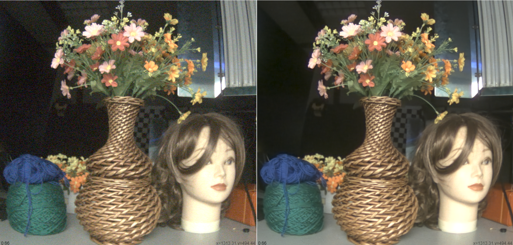

# Demo

## Video Denoising:

### **Description:** 
* **This is the comparison of the input and output in video denoiosing.** 
* **The pipeline contains pre-process, post-process and a CNN-based deep learning model.** 
* **The pre-process and post-process run on GPU and the deep learning model runs on NPU.** 
* **The Whole pipeline can run in mobile devices (Qualcomm 8th generation and MTK DX1) for a real time.** 
* **1080p:** input (**left**) and output (**right**)
* 
* **4K:** input (**left**) and output (**right**)
* 